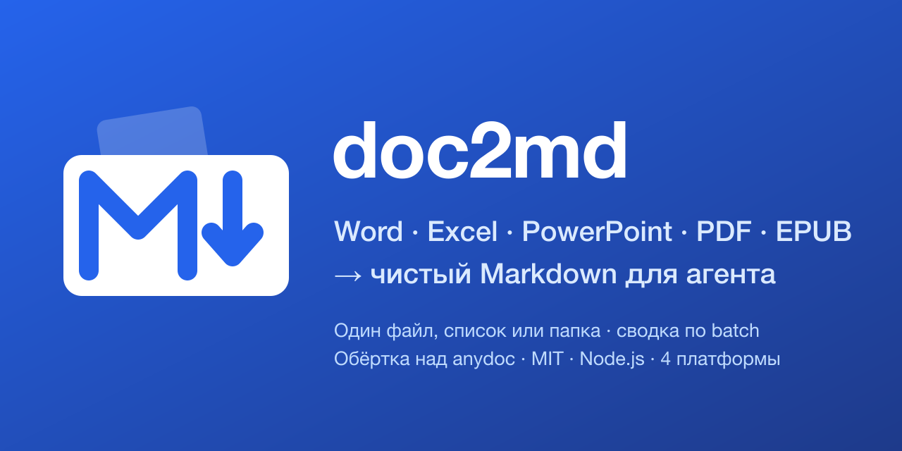

# doc2md: конвертировать Word, Excel, PowerPoint, PDF, EPUB в чистый Markdown для Claude Code, Cursor, Codex и других AI-агентов

> Скилл для AI-агентов. Прогоняет пачку разноформатных документов через один конвертер и отдаёт агенту чистый GitHub-Flavored Markdown — вместо десятка формат-специфичных ридеров на лету. Один файл, список путей или целая папка (рекурсивно). Обёртка над [firecrawl/anydoc](https://github.com/firecrawl/anydoc).

> [English version](README.en.md)

[](LICENSE)
[](CHANGELOG.md)
[](#зачем-это-нужно)
[](https://github.com/ilyautov/doc2md/stargazers)

**Быстрый старт**, одна команда для любого агента:

```bash
npx skills add ilyautov/doc2md
```

<p align="center">
  
</p>

> **Было:** агент открывает 15 договоров `.docx` — 15 вызовов docx-ридера, 15 разных дампов, тонна токенов на построчное чтение.
> **Стало:** `node convert.js ~/договоры/` — 15 чистых `.md`, единый формат, сводка `OK / ПРОПУСК / ОШИБКА`, дальше агент ищет по ним grep-ом.

## Зачем это нужно

AI-агент обычно читает `.docx`, `.xlsx`, `.pptx`, `.pdf` каждый своим отдельным ридером. На пачке из 10-20 файлов это десятки лишних вызовов инструментов и разный формат вывода под каждый тип. doc2md прогоняет всё через один конвертер, и на выходе всегда чистый GitHub-Flavored Markdown, независимо от того, что было на входе.

Это **не** замена штатным скиллам `docx`/`pdf`/`xlsx`/`pptx` для точечной работы с одним файлом (правки, форматирование, извлечение изображений — там нужны они). doc2md — для случая «прочитать содержимое пачки документов и дальше с ней работать», особенно когда документов много и формат смешанный: договоры, акты, презентации, выгрузки.

Кому это регулярно нужно: бухгалтерия, HR, юристы на due diligence — у всех периодически скапливаются пачки документов, которые надо превратить в текст для дальнейшей работы, в том числе чтобы скормить той же нейросети.

## Что внутри

```
doc2md/
├── skills/doc2md/
│   ├── SKILL.md          — сам скилл (описание + инструкция для агента)
│   └── scripts/
│       ├── convert.js    — пакетный конвертер, кросс-платформенный (Windows/macOS/Linux) — основной
│       └── convert.sh    — тот же конвертер, bash-версия для Unix
├── commands/convert.md   — слэш-команда /convert
├── .claude-plugin/       — манифесты для Claude Code + marketplace
├── .codex-plugin/        — манифест для Codex CLI
├── .cursor-plugin/       — манифест для Cursor
├── gemini-extension.json — манифест для Gemini CLI
└── assets/               — иконки и соц-превью
```

## Установка

### 1. Claude Code / Cowork / API (локальные агенты)

Через marketplace плагина:

```
/plugin marketplace add ilyautov/doc2md
/plugin install doc2md@ilyautov-plugins
```

Или скопировать папку `skills/doc2md/` целиком в свою директорию скиллов (например `~/.claude/skills/doc2md/`). В Cowork — загрузить как кастомный скилл.

### 2. Через skills.sh CLI

```bash
npx skills add ilyautov/doc2md
```

### 3. Codex CLI (OpenAI)

Манифест в `.codex-plugin/plugin.json`, пакет скилла — `skills/`. Подключается как расширение Codex; `.codexignore` отсекает дев-обвязку.

### 4. Cursor

Манифест в `.cursor-plugin/plugin.json` — автоактивация на запросах конвертации документов.

### 5. Gemini CLI

Манифест `gemini-extension.json` в корне.

### 6. Другие агенты (общий стандарт SKILL.md)

Любой агент, понимающий формат `SKILL.md`, подхватит `skills/doc2md/SKILL.md` напрямую.

> Единственная зависимость рантайма — **Node.js 18+** (он и так нужен для `npx`). Конвертер `@firecrawl/anydoc` скачивается автоматически при первом запуске; для offline можно поставить заранее: `npm install -g @firecrawl/anydoc`.

## Использование

Основной, кросс-платформенный вариант (Windows/macOS/Linux):

```bash
node skills/doc2md/scripts/convert.js договор.docx
node skills/doc2md/scripts/convert.js ~/Downloads/акты/ -o ~/Downloads/акты-md/
node skills/doc2md/scripts/convert.js a.pdf b.xlsx "отчёт за март.pptx"
```

На Unix (macOS/Linux/WSL/Git Bash) — bash-версия, поведение идентично:

```bash
bash skills/doc2md/scripts/convert.sh договор.docx
```

Без `-o` каждый файл `<имя>.<расширение>.md` пишется рядом с исходником — расширение сохраняется в имени намеренно, иначе `отчёт.docx` и `отчёт.csv` в одной папке лягут в один `отчёт.md` и один перезапишет другой. С `-o папка/` все результаты собираются в одном месте.

Триггеры для агента: «сконвертируй эти файлы», «разбери пачку документов», «не могу прочитать этот файл», «переведи в markdown», «подготовь документы для агента».

## Поддерживаемые форматы

| Группа | Расширения |
|---|---|
| Word | `.doc` `.docx` `.docm` |
| PowerPoint | `.ppt` `.pps` `.pot` `.pptx` `.pptm` `.ppsx` `.ppsm` |
| Excel | `.xls` `.xlsx` `.xlsm` `.xlsb` |
| OpenDocument | `.odt` `.ods` `.odp` |
| Прочее | `.rtf` `.epub` `.csv` `.pdf` |

Сканы и PDF-картинки без текстового слоя не читаются (в движке нет OCR) — попадают в «ПРОПУСК», batch на этом не падает. Для них нужен отдельный OCR-проход перед конвертацией (например, скилл `pdf`, шаг «сделать PDF searchable»).

## Что скрипт делает, а что нет

- Конвертирует файл(ы), печатает построчный статус и итоговую сводку: сколько `OK`, сколько `ПРОПУСК`, сколько `ОШИБКА`.
- **`OK`** — anydoc вернул код `0`. **`ОШИБКА`** — не удалось даже запустить `npx`/anydoc (нет в PATH, код 126/127): отказ окружения, а не «файл нечитаем», OCR тут не поможет. **`ПРОПУСК`** — anydoc запустился, но файл не сконвертировался: почти всегда скан/шифр/битый файл.
- Не удаляет и не трогает исходники.

> Контракт кодов возврата anydoc формально не задокументирован — скрипт трактует их консервативно (см. `SKILL.md`). При первом боевом прогоне на битом/зашифрованном файле стоит перепроверить.

## Протестировано (06.08.2026, песочница Cowork, Node 22, Linux/macOS)

- `.csv` и `.docx` с кириллицей — конвертация корректна, кириллица не теряется.
- Папка с двумя файлами одного имени, разных расширений — найдена и починена коллизия имён до релиза (см. [CHANGELOG](CHANGELOG.md)).
- Путь с пробелами и кириллицей в имени файла.
- Несуществующий путь в аргументах — пропускается с понятным сообщением, batch не падает.
- `convert.js` — та же батарея тестов повторена и прошла (рекурсивная папка, коллизия имён, кириллица, вложенная подпапка, missing path).

**Не тестировано вживую:** `.pptx`, `.xlsx`, `.pdf`, `.epub`, боевая пачка документов клиента. **Живой запуск на Windows не делал** — в песочнице нет Windows-окружения; `convert.js` написан без shell-специфичного синтаксиса и с `shell:true` для `npx` на win32, но это обоснованное рассуждение, а не проверка. Проверил формат или ОС — [заведи issue](https://github.com/ilyautov/doc2md/issues), обновлю раздел.

## Чем отличается от upstream-скилла anydoc

`firecrawl/anydoc` публикует свой минимальный skill (`npx skills add firecrawl/anydoc`) — конвертирует один файл за раз, без пакетной обработки, без сводки по batch и без русской документации. doc2md достраивает именно это: пачка/папка на вход, честная сводка `OK`/`ПРОПУСК`/`ОШИБКА`, маршрутизация сканов на OCR, кросс-платформенная Node-версия, документация на русском.

## Источник

Обёртка над [github.com/firecrawl/anydoc](https://github.com/firecrawl/anydoc) (MIT, Rust). По собственному бенчмарку авторов (⚠️ вендорские цифры, независимо не перепроверялись) против libreoffice/unstructured/markitdown/pandoc/docling/mammoth на 100 документах — anydoc первым местом по качеству на всех 14 форматах и на два порядка быстрее конкурентов. Подробнее — [SOURCES.md](SOURCES.md).

## Автор

Илья Утов — [t.me/gorilla_under_hood](https://t.me/gorilla_under_hood)

## Лицензия

MIT — см. [LICENSE](LICENSE). Движок anydoc — тоже MIT.

---

## Рядом стоят

- [**humanizer-ru**](https://github.com/ilyautov/humanizer-ru): убирает следы нейросети из русского текста
- [**marketplaces-mcp-ru**](https://github.com/ilyautov/marketplaces-mcp-ru): Wildberries, Ozon, Яндекс Маркет и Авито прямо из агента
- [**small-business-ru**](https://github.com/ilyautov/small-business-ru): 34 скилла для малого бизнеса, считают налоги и проверяют контрагента по ИНН
- [**consilium-principis**](https://github.com/ilyautov/consilium-principis): совет мыслителей, где каждая цитата сверяется дословно
- [**hefest**](https://github.com/ilyautov/hefest): химическая безопасность завода, целиком офлайн

Все проекты одним списком, разобранные по назначению: [ilyautov.github.io](https://ilyautov.github.io/). Исходники: [github.com/ilyautov](https://github.com/ilyautov). Пригодилось, поставьте звезду: по ней это находят другие.

Сделал [Илья Утов](https://github.com/ilyautov), лаборатория прикладного ИИ [AI Frontier](https://aifrontier.tech).
